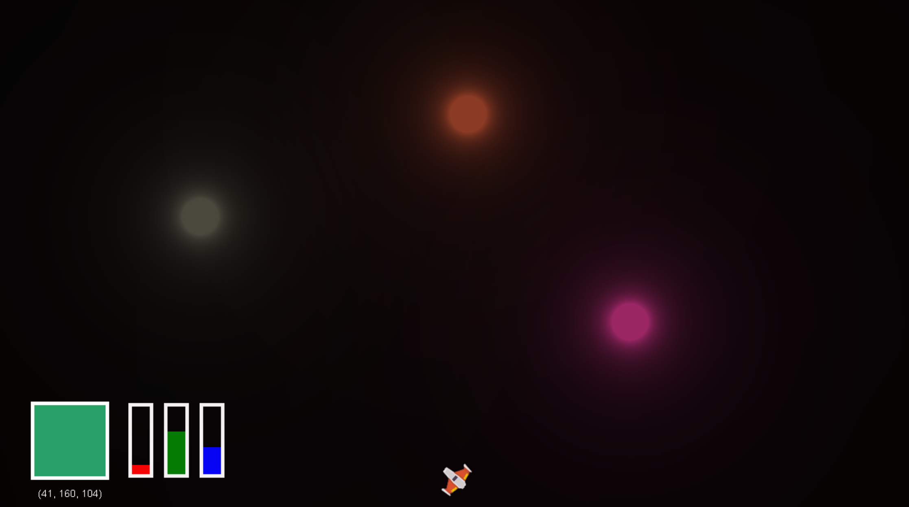
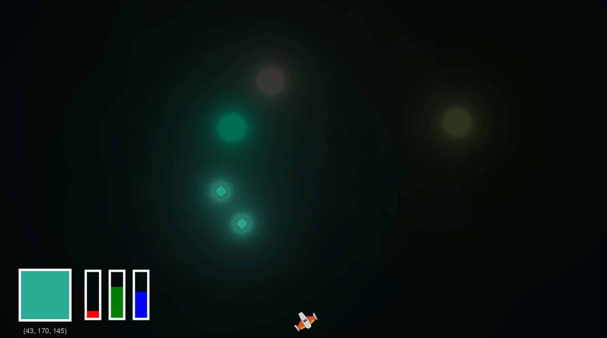
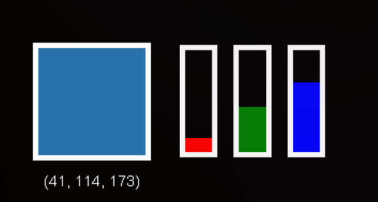

# Color Zapper

## About 

* This is a proof-of-concept project designed to support a talk called "Python in the Real World" talk for Python with Applications II at UCLA, under Dr. Harlin Lee. This was given during the spring quarter of 2022. 
* The goal of this project is to demonstrate some of the applications of Python in the game development world. This particular game is built on top of the very nice [arcade](https://api.arcade.academy/en/latest/) library, which was demonstrated by [Dr. Paul Vincent Craven](https://simpson.edu/about-simpson-college/faculty-and-staff/paul-vincent-craven) in an excellent talk at PyCon 2022, which you can watch [here](https://www.youtube.com/watch?v=DAWHMHMPVHU).
* This game is not good. In a world with more time, I would make many changes to the UI and mechanics.

## Screenshots

## Requirements
* Python 3.7+
* Arcade needs support for OpenGL 3.3+. It does not run on Raspberry Pi or Wayland.

## Installation

1. Clone this repository to your local machine using `git clone git@github.com:awordforthat/ucla-tutorial.git` (for SSH) or `git clone `https://github.com/awordforthat/ucla-tutorial.git` (for HTTPS). 
2. Open a terminal inside the repository root.
3. Create a virtual environment with `python -m venv <environment_name>` (you might have to use `python3` on a UNIX machine).
4. Activate the virtual environment:
    * On Windows, run `./<environment_name>/Scripts/activate.bat`
    * On Linux/OSX, run `source <environment_name>/bin/activate`
5. Install the project requirements `pip install -r requirements.txt`

## Game Description / Controls
The goal of the game is to shoot the colored targets with an identically-colored laser to make them disappear. 

The color of the laser is given by the swatch in the lower left corner of the screen: 

The three bars to the right of the swatch indicate the proportion of red, green, and blue that make up the color on the left. The tuple below the swatch gives the exact RGB value of the laser. Change the swatch color to match the target you're trying to hit, then fire at the targets. If the color of the laser matches the color of the target, the target will explode!

## Running the game
1. Activate the virtual environment (see [Installation](#installation)).
2. In a command line terminal, navigate to the `source` directory.
3. Run '`python .`' You should see the game window appear!

### Controls

The game is controlled via the keyboard:

| Action | Key |
| ------ | --- |
| Rotate ship left | Left arrow key |
| Rotate ship right | Right arrow key |
| Shoot | Space |
| Increase red | Q |
| Decrease red | A |
| Increase green | W |
| Decrease green | S |
| Increase blue | E |
| Decrease blue | D |

## Resources (Documentation and other links)

* Arcade API: https://api.arcade.academy/en/latest/
* Asteroid game (this game heavily borrows from this demo): https://api.arcade.academy/en/latest/examples/asteroid_smasher.html

## License

[MIT](https://opensource.org/licenses/MIT)

